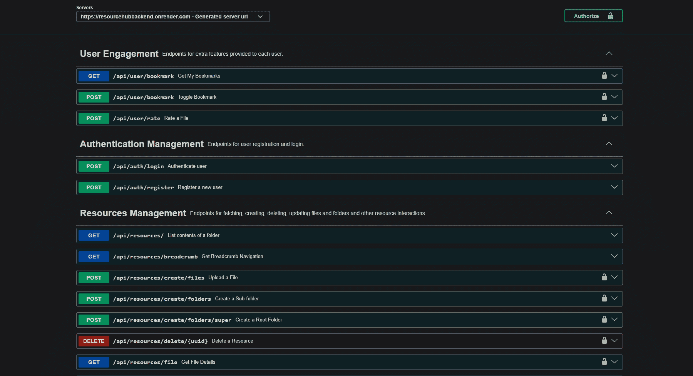
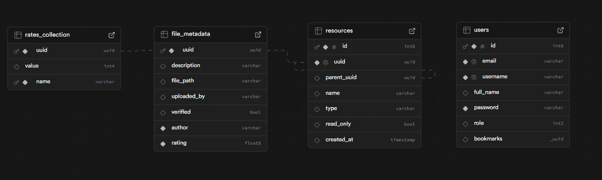

# ResourceHub API
[](http://springdoc.org)
[](https://spring.io/projects/spring-boot)

ResourceHub API is a backend application built as an academic and personal project to practice real-world backend development concepts such as authentication, authorization, database design, and file management. This project was built in mind to solve the problem of resource sharing in college environment, it allows user to easily upload resources and others to quickly view or download the resource.

The system allows users to organize digital resources into hierarchical folders, store files using a cloud storage provider, and interact with resources through ratings and bookmarks.

---

## Tech Stack

| Area         | Technology                  |
| ------------ | --------------------------- |
| Language     | Java 21                     |
| Framework    | Spring Boot 3               |
| Security     | Spring Security, JWT        |
| Database     | PostgreSQL                  |
| Migrations   | Flyway                      |
| File Storage | Cloudinary                  |
| API Docs     | Swagger (SpringDoc OpenAPI) |

---

## API Documentation

Swagger UI is available for exploring and testing the API.

### Online
Live URL: [https://resourcehubbackend.onrender.com/api-docs.html](https://resourcehubbackend.onrender.com/api-docs.html)


### Local  

* Swagger UI: `http://localhost:8080/api-docs.html`
* OpenAPI spec: `http://localhost:8080/api-docs`

### Authentication in Swagger

1. Register or login using `/api/auth/register` or `/api/auth/login`
2. Copy the returned JWT token
3. Click **Authorize** in Swagger UI
4. Paste the token and authorize

---

## Core Features

### Backend Infrastructure

* Flyway database migrations for production database handling
* Centralized exception handling following RFC 7807 error messages
* OpenAPI 3.1 documentation

### Authentication & Authorization

* JWT-based authentication along with Spring Security
* Role-based access control(RBAC) (Admin / Moderator / User)

### Resource Management

* Folder and file creation support
* File upload and storage via Cloudinary
* Resource metadata (description, author, timestamps)

### User Interaction

* User registration and authentication
* Rate and Bookmark resources

---

## High-Level System Design

### Database Design

The database schema is designed to support hierarchical resources, metadata management, and user interactions such as ratings and bookmarks.



#### Core Tables

##### users

* Stores authentication and authorization data
* Each user has a role (Admin / Moderator / User)
* Stores bookmarked resource UUIDs

##### resources

* Represents both folders and files
* `type` distinguishes between FOLDER and FILE
* `parent_uuid` foreign key referencing to resources(uuid)
* `parent_uuid = NULL` represents a root-level super folder
* `read_only = true` prevents file creation under that resource (folders only)

##### file_metadata

* One-to-one relationship with `resources.uuid`
* Stores Cloudinary file path and descriptive metadata

##### rates_collection

* Stores individual user ratings
* Only the current user’s rating is returned for privacy

### Resource Hierarchy Design

* Folder and file hierarchy is managed using a self-referencing `parent_uuid`
* This enables:
  * Infinite nesting
  * Efficient breadcrumb generation
  * Simple traversal from root to leaf

### Rating System Design

* Ratings are stored dynamically in `rates_collection`
* For each file:
  * User ratings are treated as a key-value structure (user → rating)
  * One column for file uuid

* API responses return:
  * Aggregated rating
  * Current logged-in user’s rating only

---

## Docker Support

The project supports containerized development and deployment using Docker.

### Docker Files

* **Dockerfile**
  Used for production builds with optimized image size. Handling building and deploying of jar file.

* **Dockerfile.dev**
  Used for development with faster rebuilds and easier debugging. Generation of jar file is done on host computer to speed up contanarization.

### Build & Run (Production)

```bash
docker build -f Dockerfile -t resourcehub-api .
docker run -p 8080:8080 resourcehub-api
```

### Build & Run (Development)

```bash
gradlew build
docker build -f Dockerfile.dev -t resourcehub-api-dev .
docker run -p 8080:8080 resourcehub-api-dev
```

---

## Getting Started

### Prerequisites

* JDK 21
* Gradle
* PostgreSQL

### Setup

```bash
git clone https://github.com/doesDeveloper/resource-hub-backend.git
cd resource-hub-backend
```

### Configuration
This project supports different `application.properties` for production and development runtime.

```properties
spring.datasource.url=jdbc:postgresql://localhost:5432/resourcehub_db
spring.datasource.username=your_db_user
spring.datasource.password=your_db_password

spring.flyway.enabled=true

cloudinary.url=your_cloudinary_url

jwt.secret=your_jwt_secret
```

### Run

```bash
./gradlew bootRun
```

---

## Project Scope & Limitations

* This project focuses on backend functionality only
* Frontend is not included in this repository
* Designed primarily for learning and demonstration purposes

---

## Author

**Ahmad Umar Usmani**
*  GitHub: [doesDeveloper](https://github.com/doesDeveloper)